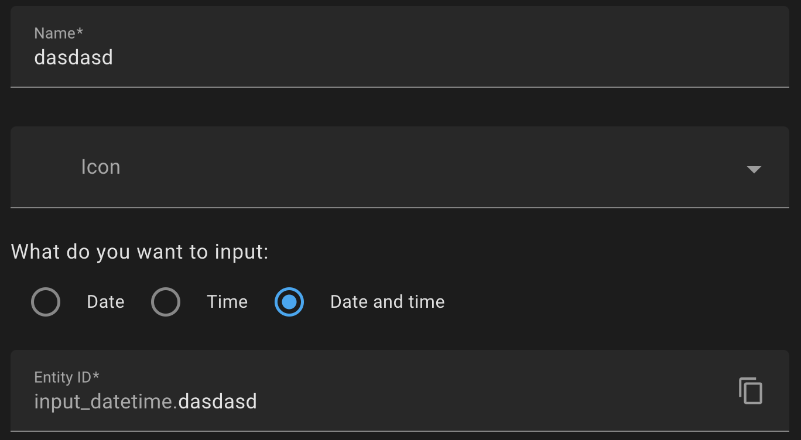
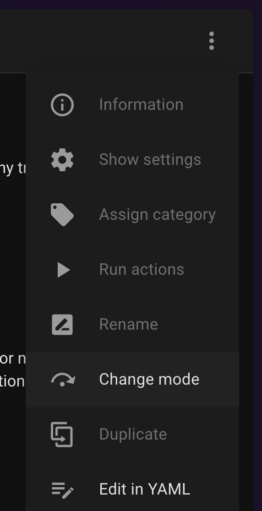

# How to set up a time based simple automation
xx passed since (......)

## Description
This Tutorial aims to show you how to create a time based automation using the built in "Helpers"
- Make a Helper that stores the date and time value
- Create an automation and using ([Jinja2](https://jinja.palletsprojects.com/en/stable/) and simple YAML)
- Example use

## Table of Contents
- [Prerequisites](#prerequisites)
- [Introduction](#introduction)
- [Step 1 : Making a Helper](#step-1--making-a-helper)
- [Step 2 : Making the Automation trigger/condition](#step-2--making-the-automation-triggercondition)
- [Updating the Helper](#updating-the-helper)
- [Example Use](#example-use-)


## Prerequisites
- A Home Assistant installation (either HA OS, Docker, Supervised, and HA Core works)

## Introduction
In this tutorial, you'll learn how to make a time based automation trigger. You'd use this trigger with various applications, including:
- A notification sent to your phone  xx days of not doing the laundry
- Triggering the charger of your Plugged in HA Dashboard to turn on every xx hours for yy time

What you're gonna do : 
- You'll use the built in "Helpers" to store and easily update the base time (the last time of ....)
- You'll modify the Jinja2 script to suit your own setup

## Step 1 : Making a Helper
Making a Helper to store the time you want to start counting after is the simplist way to easily update (if needed) via either a button or anything else.
- Go to Settings at the bottom left > Devices and Services > Helpers


- Create a New Helper
- Data and/or Time

- Give your new Helper a name and choose "Date and Time"
- Click Create to create the new helper

- Note : To get the entity ID of your new Helper, click on the three dots at the right and then "Show Settings" Entity ID will be as follows (input_datetime.{HELPERNAME})



## Step 2 : Making the Automation trigger/condition
We will use the Helper as a baseline to calculate xx seconds after {Helper}.
The basic code you'll insert is :

- Use either of these depending on if you're using it as the main trigger (When x time passes do yy) or as a condition (if i press a button, check if yy time hass pass)

```YAML
- condition: template
    value_template: >-
      {{ (now().timestamp() -
      (state_attr('{The Entity ID of your helper}', 'timestamp')
      or 0)) > {Time in seconds} }}
```
```YAML
- trigger: template
    value_template: >-
      {{ (now().timestamp() -
      (state_attr('{The Entity ID of your helper}', 'timestamp')
      or 0)) > {Time in seconds} }}
```

- {The Entity ID of your Helper} -> Find in [Step 1 - Note ](#step-1--making-a-helper)
- {Time in seconds}: 
    - hour = 3600
    - three days = 259200
    - week = 604800
    - year = 31,536,000


- Go to Settings > Automations & Scenes > Automation 

- Create a new a new automation and click on the three dots on top, then "Edit in YAML"

- You'll have something similar to this
```yaml
alias: {Your Title}
description: "{}"
triggers:
conditions:
actions:
```
- Copy either the trigger or the condition and paste it under its own blcok, it should look like this (depending if you choose Triggers or Condtions) :

```yaml
alias: {Your Title}
description: "{}"
triggers:
- trigger: template
    value_template: >-
      {{ (now().timestamp() -
      (state_attr('{The Entity ID of your helper}', 'timestamp')
      or 0)) > {Time in seconds} }}
conditions:
actions:
```


## Updating the Helper
It's simple to update the Helper, Just send this action via either a script, button or anything else
```YAML
  - action: input_datetime.set_datetime
    metadata: {}
    data:
      datetime: "{{ now().strftime('%Y-%m-%d %H:%M:%S') }}"
    target:
      entity_id: input_datetime.colored_last_laundry_day
```


## Example Use :
I use this condition to get a notification when 3 days pass since the last time i did the laundry, the notification updates depending on the day (if it's 5 years later the notification says so).
The automation consists of: 
- Data and Time Helper
- A Script to update the Date and Time helper
- An automation
I use a Script to update the Helper for simplisity, since i use the same update in different dashboards.


Helper : Date and time
Script : 
```YAML
sequence:
  - action: input_datetime.set_datetime
    metadata: {}
    data:
      datetime: "{{ now().strftime('%Y-%m-%d %H:%M:%S') }}"
    target:
      entity_id: input_datetime.inbetween_last_laundry_day
alias: update_inbetween_last_laundry_day
description: ""
```
Automation : 
```YAML
alias: Laundry Reminder After 3 Days or more
description: ""
triggers:
  - trigger: template
    value_template: >-
      {{ (now().timestamp() -
      (state_attr('input_datetime.input_datetime_last_laundry_day', 'timestamp')
      or 0)) > 259200 }}
conditions:
  - condition: template
    value_template: >-
      {{ (now().timestamp() -
      (state_attr('input_datetime.input_datetime_last_laundry_day', 'timestamp')
      or 0)) > 259200 }}
actions:
  - action: notify.mobile_app_abdullahs_iphone
    data:
      message: >-
        It's been {{ ((now().timestamp() - 
        (state_attr('input_datetime.input_datetime_last_laundry_day',
        'timestamp')  or 0)) // 86400) | int }} days since your last laundry.
      title: Do the Laundry!
```


## ---
This tutorial was created in my free time as a fun project. I am a Computer Science freshman at Prince Sultan University (PSU). If you’re interested, feel free to connect with me on [Linkedin](www.linkedin.com/in/alafari-abdullah)